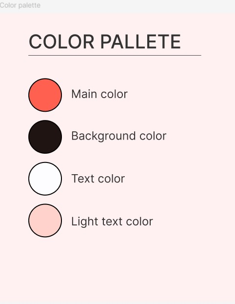

# Figma essentials

## **Assignment Description**

- Create a simple responsive hero section in Figma; elements/components in your Figma frame should nicely behave as you resize the corresponding parent frame.
- The hero section will include a menu. Make menu items a Figma component.
- Use auto-layout, auto-spacing, constraints features.

It is important to emphasize that the decision regarding the final selection for the theme of the site has not been made. So far, it is a website for taxi services.

In figma, the appearance of the hero section on desktop, tablet and mobile has been done.

- Color pallete for the website

- Hero section in desktop view

- Hero section in tablet view

iPad 9’7’’

- Hero section in smartphone view
    
    
    
    iPhone 13
    

- We created a logo using Adobe Illustrator.

In this repository there’s a figma file as well as a short video that displays the resposiveness of the hero section.