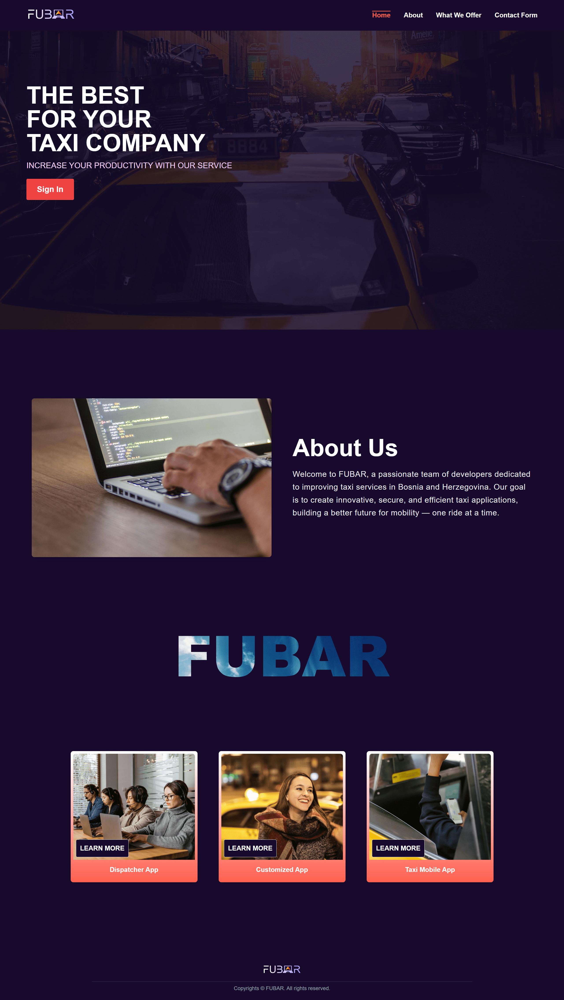
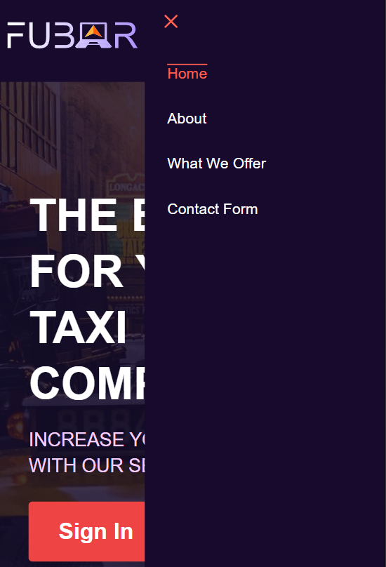

# Full Responsive Page Coding

## **Assignment Details**

### **Implementation**

Fully code the landing/home page from the above step. In particular, ensure responsiveness so that your web page works well on different screen sizes. Try to implement mobile navigation menu.

## Our work

We have a deployed Next web application, accessible via a [public URL.](https://hci-project-kappa.vercel.app/) We have implemented mobile navigation with hamburger menu.

And below are images of the high-fidelity prototypes (both mobile and desktop). 

Desktop version

Mobile version

Hamburger menu for mobile version