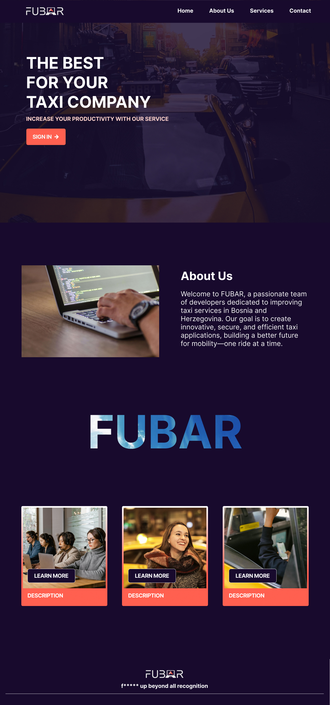

# Low/High-fidelity prototype

## **Assignment Details**

Utilizing Figma, design either a low or high-fidelity prototype for the landing/home page of your web application. Do make use of ChatGPT for your project to speed this task up. Provide it with some context: personas, sitemap, description, developed in the previous assignments. Then ask ChatGPT to propose design requirements and content outline for your page.

## Our work

We’ve developed the initial high-fidelity prototypes of our website's homepage, designed for both desktop and mobile versions.

Desktop version

Mobile version