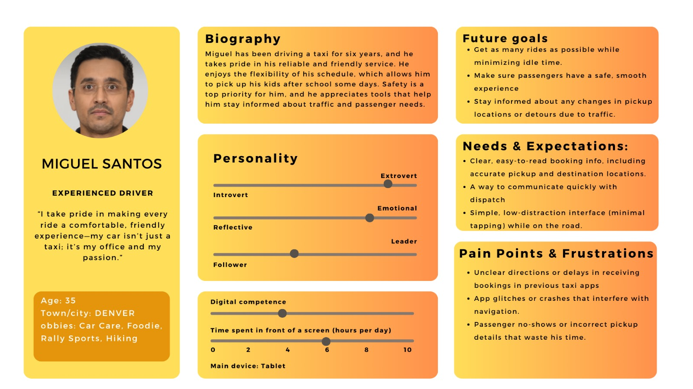
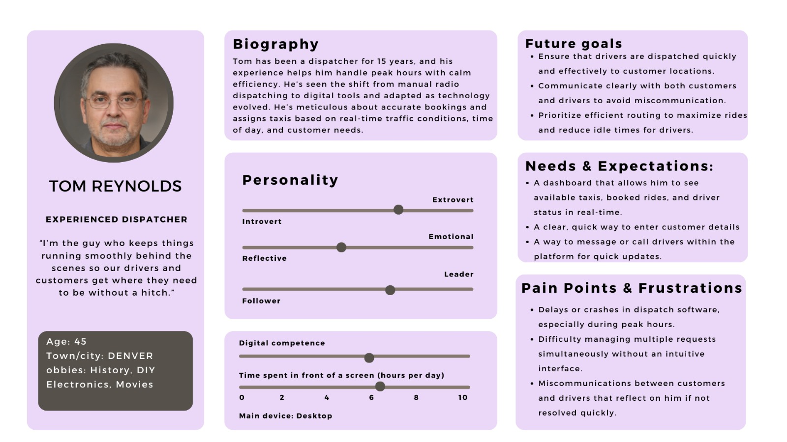
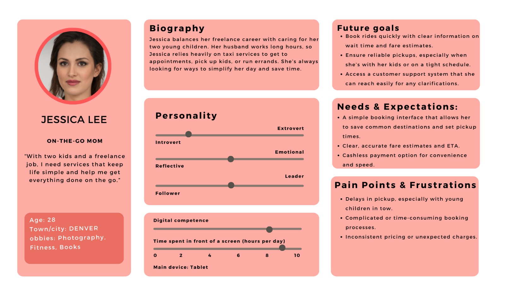
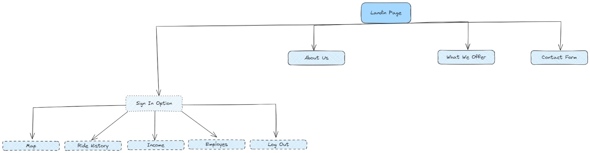

# User personas and information architecture

## **Assignment Description**

- Create a simple responsive hero section in Figma; elements/components in your Figma frame should nicely behave as you resize the corresponding parent frame.
- The hero section will include a menu. Make menu items a Figma component.
- Use auto-layout, auto-spacing, constraints features.

## Our work

### User personas

- Experienced driver
    
    
    

- Experienced dispatcher
    
    
    

- On-the-go mom
    
    
    

### Sitemap

Visual representation of our sitemap

